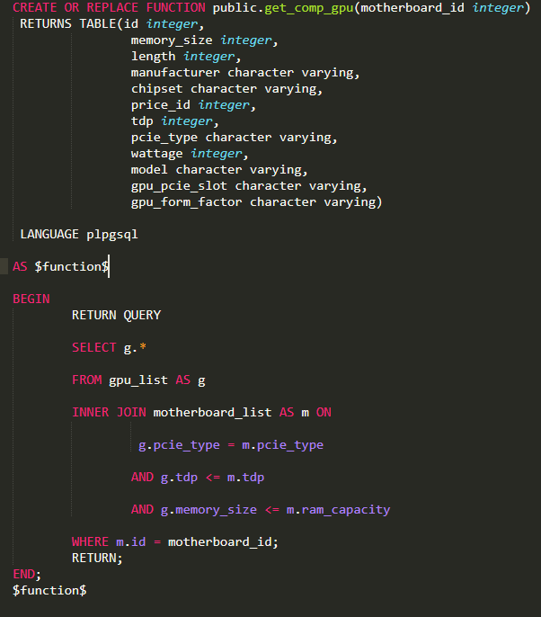
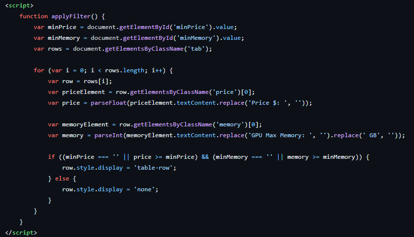

# 💻 Personal Computer Assembly System

This is my university graduation project.

The goal of this project is to develop an informational system that allows users to:
- Estimate the total cost of building a custom PC.
- Automatically check compatibility between selected components.

---

## 🛠️ Project Stages

### 1️⃣ Database Architecture

I designed the database and populated it with high-quality, market-relevant components:

- CPU  
- GPU  
- Motherboard  
- Storage  
- RAM  
- CPU Cooler  
- Computer Case  
- Power Supply  

#### 📊 Database Schema

---

### 2️⃣ Compatibility Algorithm

An algorithm was developed to ensure selected components are compatible with each other.

---

### 3️⃣ Smart Filtering

Users can filter results based on:
- Purpose (e.g., gaming, office, editing)
- Budget

---

### 4️⃣ Web Interface

I implemented the front-end using **Thymeleaf**, a modern server-side Java template engine.  
Thymeleaf was chosen over JSP due to its cleaner syntax, better integration with Spring Boot, and improved developer experience.

---

## ✅ Features

- Real-time price calculation  
- Component compatibility validation  
- Dynamic filtering system  
- User-friendly web interface

---

## 📌 Technologies Used

- Java  
- Spring Boot  
- Thymeleaf  
- PostgreSQL  
- HTML/CSS

---

## 📁 Repository Structure

- `/src` – source code  
- `/static` – static web assets  
- `/templates` – Thymeleaf templates  
- `pc_system_diagramm.png` – database schema

---

## 📬 Contact

Feel free to reach out if you want to collaborate or have any questions.

